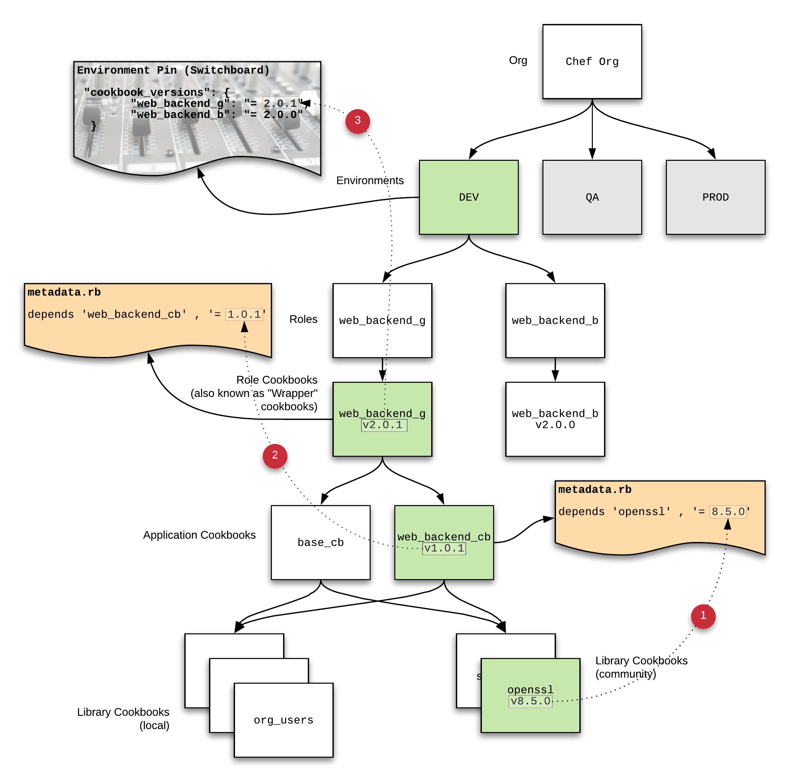

# Role Cookbook Model

This is intended to show a working example of the "Role Cookbook Model". By 
following the steps outlined below, you can setup a Chef Environment to use this
model and try it out for yourself. Most of this follows the model set forth by
Jeremy Miller @jeremymv2, a colleague of mine @Chef, you can see his original 
Environment Pinning guide here - https://github.com/jeremymv2/env_pinning.

## What is the "Role Cookbook Model?"

The Role Cookbook Model (referred to as the RCM from here) has been referred to 
as a few different things overthe years. It's been called the "Application" 
cookbook model, "Environment" model, and probably some other things. I thin the 
"Role" model is the best namefor this because it just makes sense, you'll see what 
I mean when you read on.

### Key Concepts

* **Limited Blast Radius** - The RCM helps to ensure that changes you make to a
system, or group of systems, is limited to the _intended_ target(s). 
* **Iterate & Fail Often** - When you're blast radius is large, it makes it hard
to fail often, because failing means a bunch of things get broken. In true (here
come some fun DevOps~ words) DevOps fashion, it helps you to be more agile, by
allowing you to target smaller groups of systems in a more controlled manner.
And helps you fix problems in lower environments more quickly.
* **Appropriately Scoped** - The RCM pattern should typically follow your 
organizational pattern, meaning the scope of your orgs, environments and roles
should generally line up with the teams that actually touch the infra and apps
that live within them.
* **Scaleable** - This pattern is scaleable because it is repeatable and 
efficient. It lends itself to the practice of starting small, iterating, then
repeating with other targets. It also allows for complete autonomy within 
environments, for example, the ability to have multiple roles within an 
environment and make changes to them without affecting each other.

### A Simplified View of the Role Cookbook Model

The image below shows a simplified view of the Role Cookbook ecosystem, along
with the steps needed to update a Role Cookbook and publish it to your
environment. You'll notice the roles end in `_g` for "green" and `_b` for "blue"
, this is for a typical blue/green deployment scenario.

1. A new version of the `openssl` cookbook has become available in
the community Chef Supermarket. The first step is to update the `metadata.rb` of
the Application Cookbook, in this case `web_backend_cb`. Also, as part of this 
step, you would bump the version of the `web_backend_cb` to a higher version.
2. The next step is to update your Role Cookbook with the new version of the
application cookbook you just bumped. Again, in doing so, you will in-turn bump
the version of the Role Cookbook.
3. The final step is to "flip the switch" on the Environment 'cookbook_versions'
pinnings. Once you do this, and push the Environment `.json` up to the Chef
Server, the changes will take affect.

Notice in the above model, the "blast radius" is limited to the `web_backend_g`
role _only_. This ensures that the changes we are making are only going to be
applied to the nodes that have been assigned that role.

